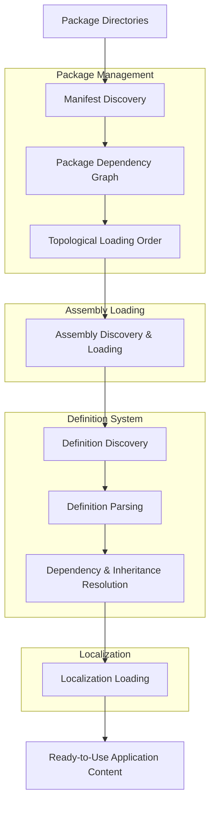
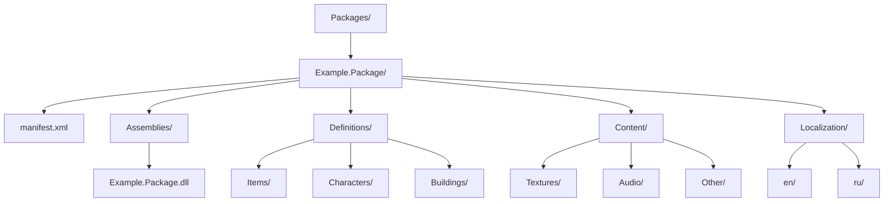

# Grekov

A centralized package, content, localization, and definition management framework for .NET applications.

Grekov provides a unified infrastructure for discovering, loading, and managing application packages. It handles package manifests, dependency resolution, assembly loading, definition processing, and localization.
The framework is designed to simplify the creation of modular applications where functionality, content, and data definitions are organized into independent packages.

> [!WARNING]
> This project was created for educational purposes and is still under development. It may contain bugs, incomplete features, and architectural flaws. The code is not production-ready and should be used with caution.

Grekov is named after **Mitrofan Borisovich Grekov**, a Russian painter known for his works depicting military and historical subjects. Learn more about Mitrofan Grekov on [Wikipedia](https://en.wikipedia.org/wiki/Mitrofan_Grekov).

## Features

- Package Management — discover and manage application packages from configured directories.
- Manifest Processing — read package manifests and build a structured package model.
- Dependency Resolution — construct a topological loading order based on package dependencies.
- Assembly Loading — discover and load assemblies provided by packages.
- Definition System — read, resolve, and manage definitions and their dependencies.
- Inheritance Resolution — support definition inheritance and related resolution processes.
- Localization — provide centralized localization management for package content.
- Modular Architecture — organize application functionality and content into independent packages.

## How It Works

Grekov follows a centralized pipeline for loading and preparing application packages.

1. Package Discovery

Grekov scans configured package directories and identifies available packages.
Each package contains a manifest describing its identity, dependencies, and available resources.

2. Manifest Processing

The package manifest is read and converted into a structured package representation.
The manifest provides the information required to understand the package and its relationships with other packages.

3. Dependency Resolution

Grekov builds a dependency graph from the discovered packages and calculates a topological loading order.
This ensures that packages are loaded according to their dependencies.

4. Assembly Loading

After determining the loading order, Grekov discovers and loads the assemblies associated with each package.
These assemblies provide the executable functionality and definition readers required by the application.

5. Definition Processing

Grekov discovers and reads definitions from the loaded packages.
The definition system is responsible for processing definitions, resolving references and dependencies, and handling inheritance between definitions.
This allows packages to provide structured data that can be extended and reused by other packages.

6. Localization

Once package content and definitions are available, Grekov loads and manages localization resources.
This provides a centralized way to access localized content across the application.

## Package Structure

A typical package may look like this:

The exact package structure depends on the package manifest and the systems consuming its resources.

## Core Concepts

### Packages

Independent units of application functionality and content.
Packages may contain assemblies, definitions, content resources, and localization data.

### Manifests

Package metadata describing the package and its dependencies.
Package Dependency Graph
A directed graph representing relationships between packages. Grekov uses this graph to determine a valid loading order.

### Assemblies

Compiled .NET libraries loaded from packages to provide functionality and definition processing capabilities.

### Definitions

Structured data objects describing application entities and their properties.
Definitions may reference other definitions, inherit from base definitions, and depend on data provided by other packages.

### Localization

A centralized system for loading and accessing localized resources provided by packages.

## Intended Use Cases

Grekov is designed for applications that require modular content and functionality, such as:

- Simulation frameworks.
- Game engines and simulation games.
- Data-driven applications.
- Applications with extensible content packages.
- Projects requiring shared definitions and localization.

## License

[**Grekov**](https://github.com/NovoDwarf/Grekov) is licensed under the [**MIT License**](), see [LICENSE](LICENSE) for more information.